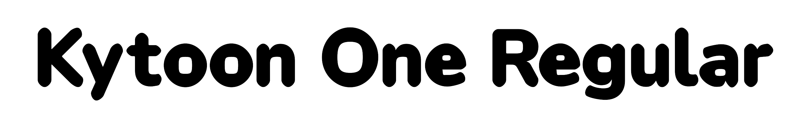

# Kytoon One



Kytoon One is a display typeface based on [Nunito](https://github.com/googlefonts/nunito) by Vernon Adams. Every contour has been pushed outward and all corners rounded as far as they go, so the letters look inflated. Single weight, Regular only.

The script that transforms Nunito into Kytoon One is at `sources/kytoon.py`.

## Download

[Releases](https://github.com/michaelsfonts/kytoon/releases/latest). OTF, TTF, WOFF, WOFF2, or a zip with everything.

Same files in [`fonts/`](fonts/).

## Building

Font is built using [gftools](https://github.com/googlefonts/gftools).

Recommended: set up a virtual environment so the dependencies stay separate from the rest of your system. Run this once:

```
python3 -m venv sources/venv
source sources/venv/bin/activate
```

You will see `(venv)` appear at the start of your prompt. That means the environment is active. Repeat the `source` line in any new terminal window to turn it back on.

Install dependencies:

```
pip install -r requirements.txt
```

Build:

```
./sources/build.sh
```

The new font files will appear in `fonts/ttf/`, `fonts/otf/`, and `fonts/webfonts/`.

The build reads the finished source `sources/KytoonOne-Regular.ufo`. This is the shipped UFO with all the outline corrections, not the raw output of `kytoon.py` (see below).

`build.sh` runs `gftools builder config.yaml` for you and adds two things gftools does not do on its own. First, it checks `features.fea` before building, because Glyphs sometimes exports an empty `@Uppercase` list that makes the build crash, and it fixes that if it finds it. Second, it creates the `.woff` file, since gftools only produces `woff2`.

Note: you can still run `cd sources` and `gftools builder config.yaml` yourself, but you will only get otf, ttf, and woff2, and it will not catch the empty `@Uppercase` problem if it happens.

## Regenerating the UFO from Nunito

The script `sources/kytoon.py` is what turns a Nunito UFO source into the inflated base shapes for Kytoon One. You only need this if you want to rebuild the source from scratch.

To run it, `cd` into `sources/` and point the script at a Nunito UFO file:

```
cd sources
python kytoon.py path/to/Nunito-Regular.ufo
```

It will write a new `Kytoon-Regular.ufo` next to the script. This filename is intentionally different from the shipped source (`KytoonOne-Regular.ufo`) so the script cannot overwrite it. You can open the output in Glyphs or any other UFO editor.

Note: this script only produces the base inflated shapes from Nunito. It does not include the outline corrections that the shipped `KytoonOne-Regular.ufo` has. Think of the script's output as a starting point, not a finished font.

## License

Kytoon One is licensed under the [SIL Open Font License, Version 1.1](OFL.txt).

Nunito was originally designed by Vernon Adams. Kytoon One is a derivative work by Michael Seh.
